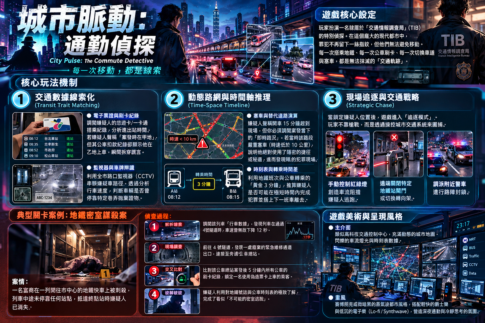

# 《雙北漫遊偵探：都會行蹤》✕《城市脈動：通勤偵探》
### Urban Wanderer: Taipei Mystery ✕ City Pulse: The Commute Detective (Lite Edition)

> **國小六年級獨立研究專題成果 —— 結合真實雙北地理圖資、交通數據大數據線索化與國小自然科學鑑識的純靜態網頁 RPG（簡易版）**

🌐 **線上立即遊玩 (GitHub Pages)**：  
https://hsiaoyujui114-code.github.io/city-pulse-detective/

📄 **完整專題企劃書**：  
https://hsiaoyujui114-code.github.io/taipei-detective-rpg/proposal.html

---

## 👥 獨立研究三人小組全員協同研發理念

本專案由台北市國小六年級獨立研究小組自主設計與研發，並整合了成員益碩提出的《城市脈動：通勤偵探》核心交通推理機制。
堅持「全員全能協同」原則：共同編撰劇本、走訪雙北街區測繪地理、在實驗室親手做廣用試紙實驗，並與 AI 協同編寫純前端網頁程式碼。

---

## 🎮 遊戲核心玩法與亮點（簡易版 MVP）

### 1. 🎛️ 交通情報調查局 (TIB) 數據線索化
- **💳 電子票證時間軸 (EasyCard Timeline)**：調閱嫌疑人的悠遊卡進出站數據。若嫌疑人聲稱「案發時人在板橋睡覺」，但悠遊卡紀錄卻顯示其 14:05 於台北車站刷卡出站，瞬間戳破謊言！
- **📹 全市路口監視器 (CCTV)**：串聯中華路、市民大道監視器影像，分析車速與暗巷停靠丟棄物證痕跡。
- **🚦 即時路況與塞車演算 (Traffic Flow)**：嫌疑人聲稱開車 15 分鐘趕抵，調閱交通局案發即時路況（時速 8km/h 嚴重塞車，需 55 分鐘），證實其證詞造假。
- **⏱️ 時刻表與轉乘「黃金 3 分鐘」**：利用捷運班距與公車 307 轉乘時間差，精確推算嫌疑人的真實作案移動軌跡。

### 2. 🚶‍♂️ 雙北街頭漫遊與慢活生活
- **雙北景點穿梭**：西門町中華路商圈、台北車站地下長廊、重慶南路老商辦偵探事務所。
- **超商溫馨互動 ✕ 環保減塑理念**：走進街角 24H 便利商店，夾取熱騰騰茶葉蛋（$13）補充體力，店員親切提醒小心燙；**響應環保減塑政策，堅守不主動給衛生紙與多餘塑膠袋**！
- **大眾運輸通勤**：刷悠遊卡扣款搭乘捷運（$20）或公車 307（$15），伴隨 2.5 秒精緻車窗流光剪影與捷運動態進站四音階（G4, B4, D5, G5）！

### 3. 🔬 首發示範大案：西門町咖啡拿鐵毒發案
- **自然科學動手實驗**：使用國小自然科教過的【廣用試紙 (pH)】對咖啡殘留液取樣，試紙由黃綠變深紅（pH 2.0 強酸性），檢出工業草酸結晶，擊破「單純牛奶過敏」的卸責藉口！
- **⚖️ 司法偵查筆錄與「物證對質打臉」**：調閱嫌犯張世傑與許雅筑的供詞，挑選正確客觀物證直接打臉對質，摧毀心理防線！
- **🚨 智力交通圍捕模式（拒絕暴力與槍戰）**：犯人企圖逃跑時，切換 TIB 交通控制台：
  1. 調控中華路口紅綠燈延長為 99 秒，以車流截停逃跑路徑；
  2. 遠端指令封閉捷運西門站 6 號出口閘門；
  3. 調度漢中街派出所巡邏警車合圍，安全緝拿歸案！

### 4. 👁️ 防嚇馬賽克保護切換開關
- 響應六年級獨立研究教育倫理，頂部 HUD 附設【👁️ 馬賽克切換】按鈕。在調查較緊張刺激的案發現場時可一鍵切換像素遮罩，維護低年級同學心理安全！

### 5. 🔊 純前端免伺服器與 Web Audio API
- 100% 原生純靜態網頁（HTML5 + Canvas + Vanilla JS + CSS3），完全無任何外部 npm 依賴或後端 server。
- 使用 Web Audio API 即時合成 8-bit 音效、捷運報站音階與打臉對質聲，任何電腦與手機瀏覽器點開即玩！

---

## 🕹️ 遊戲操作方式

| 操作方式 | 功能說明 |
| :--- | :--- |
| **[W] [A] [S] [D]** 或 **[方向鍵]** | 角色在雙北街區中上下左右移動 |
| **[滑鼠點擊 / 螢幕點選]** | 點擊畫布任何位置，偵探角色會自動步行前往目的地 |
| **[空白鍵 Space]** 或 **[Enter]** | 靠近 NPC、店家或案發現場光圈時進行對話與調查 |
| **頂部 HUD 按鈕** | 隨時切換 TIB 交通控制台、大眾運輸、超商、考據卡、馬賽克與天氣 |
| **手機 / 平板觸控** | 畫面右下角配置虛擬十字方向鍵，支援全觸控互動 |

---

## 🚀 本地執行與 GitHub Pages 部署說明

### 1. 本地直接執行
直接以任何瀏覽器雙擊開啟專案目錄中的 `index.html` 即可完整遊玩！

### 2. GitHub Pages 自動發布
本儲存庫已包含 `.github/workflows/deploy.yml` 自動部署流程：
1. 進入本 GitHub Repo 的 **Settings ➔ Pages**
2. 在 **Build and deployment** 下方的 **Source** 選擇 **GitHub Actions**
3. 等候 1~2 分鐘，網站便會發布至：  
   `https://hsiaoyujui114-code.github.io/city-pulse-detective/`
