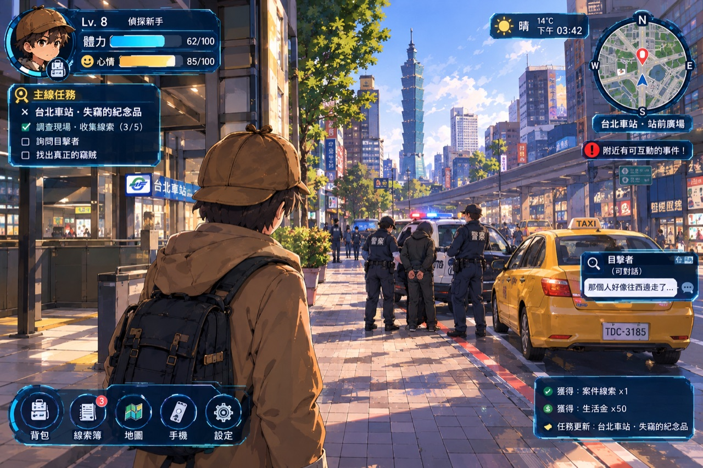

# 《雙北漫遊偵探：都會行蹤》✕《城市脈動：通勤偵探》
### Urban Wanderer: Taipei Mystery ✕ City Pulse: The Commute Detective (3D 專屬私服器版)

> **國小六年級獨立研究專題成果 —— 結合真實雙北地理圖資、3D 街區立體漫遊、交通數據線索化與專屬私服器多人同屏的世界**



🌐 **線上立即遊玩 (GitHub Pages)**：  
https://hsiaoyujui114-code.github.io/city-pulse-detective/

📄 **完整專題企劃書**：  
https://hsiaoyujui114-code.github.io/taipei-detective-rpg/proposal.html

---

## 🎮 3D 專屬私服器版核心特色

### 1. 🌐 專屬私服器多人同屏共享世界 (Dedicated Private Server)
- **同一個私服器、同一個世界**：依據企劃書「04A 專屬私服器」規範，所有同學連入同一個私服世界實例，在 3D 雙北開放地圖中同屏漫遊！
- **街頭同屏可視化**：在台北車站站前廣場漫步時，能即時看到身邊其他同學的 3D 小偵探角色奔跑、轉向、揮手！
- **頭頂暱稱與動作狀態氣泡**：角色頭頂即時顯示【小偵探】、名牌徽章與即時聊天動作氣泡（如 `🔍 巡視中`、`🥚 吃茶葉蛋`）。
- **全服破案號外廣播 (Breaking News)**：一旦任何一名同學透過交通數據對質打臉破案，私服器會向全服所有在線玩家推播滾動式號外快報！
- **智慧離線保護**：在無私服器的純靜態 GitHub Pages 上遊玩時，系統會自動生成同儕模擬小偵探，確保單機與線上皆能流暢體驗！

### 2. 🏙️ 3D 立體都會街區（依據雲端硬碟美術風格打造）
- **真實雙北地標立體重現**：
  - 遠方巍峨矗立的 **台北 101 大樓** 天際線
  - **全家 FamilyMart 24H 便利商店**（經典綠白藍招牌、落地玻璃窗、茶葉蛋香氣）
  - **台北車站 Taipei Main Station**（三鐵共構大廳、站前廣場、捷運標誌）
  - **寧夏夜市美食小吃街**（紅燈籠、現炸鹽酥雞、炭烤章魚燒攤位）
  - **警局巡邏車與警戒線現場**（紅藍警笛爆閃燈、封鎖線 🚧、黃色計程車）
- **第三人稱 3D 視角追蹤相機**：滑鼠拖曳可 360 度自由環視街區，滾輪縮放視角。

### 3. 🎛️ 交通情報調查局 (TIB) 數據推理核心
- **💳 悠遊卡時間軸比對**：嫌犯聲稱「在板橋睡覺」，但調閱悠遊卡進出站紀錄顯示其於 14:38 在台北車站 B1 刷卡扣款 $30，瞬間擊潰不在場證明！
- **📹 CCTV 監視器車牌軌跡**：串聯路口監視器抓拍可疑黑鴨舌帽男子丟棄物證畫面。
- **💥 司法偵查筆錄「物證打臉」對質**：現場出示交通票證紀錄當場打臉嫌疑人，順利追回失竊公事包！

### 4. 🥚 國小六年級生活化特色 ✕ 環保減塑理念
- 走進全家便利商店，花費 $13 生活金夾取熱騰騰茶葉蛋補充體力；店員親切提醒小心燙，並**堅守教育部環保減塑政策：絕不隨意提供衛生紙與塑膠袋**！
- 頂部 HUD 配置【👁️ 防嚇馬賽克】保護切換開關，照顧低年級同學心理安全。

---

## 🕹️ 遊戲操作方式

| 操作按鍵 | 功能說明 |
| :--- | :--- |
| **[W] [A] [S] [D]** 或 **[方向鍵]** | 控制 3D 偵探角色在雙北街頭奔跑漫遊 |
| **滑鼠左鍵按住拖曳** | 旋轉 3D 視角攝影機環視街景 |
| **滑鼠滾輪** | 縮放第三人稱攝影機鏡頭距離 |
| **[E] 鍵** 或 **點擊浮動按鈕** | 靠近建築或現場時進行互動（進全家、問司機、對質筆錄） |
| **底部功能按鈕** | 開啟全家超商、夜市美食、TIB控制台、線索簿、捷運地圖、私服器設定 |
| **左下角聊天室** | 輸入訊息按 Enter，文字將即時出現在 3D 角色頭頂氣泡並廣播全服 |

---

## 🚀 私服器啟動與執行方式

### 方式 A：啟動本地多人專屬私服器 (推薦)
在專案目錄下執行：
```bash
# 安裝依賴 (僅需一次)
npm install

# 啟動專屬私服器
npm start
# 或
node server.js
```
伺服器將於 `http://localhost:3000` 啟動，只要局域網內的其他同學在瀏覽器開啟該網址，所有人便會進入同一個 3D 台北世界！

### 方式 B：GitHub Pages 線上直接遊玩 (免伺服器)
直接開啟：  
👉 [https://hsiaoyujui114-code.github.io/city-pulse-detective/](https://hsiaoyujui114-code.github.io/city-pulse-detective/)
